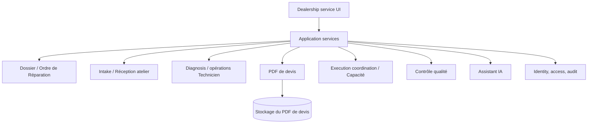

# Architecture

## Objet
Décrire l’architecture cible d’une plateforme autonome et maintenable d’orchestration de l’après-vente automobile.

## Périmètre
Ce guide logique couvre le domaine, les applications, l’infrastructure, la sécurité, l’observabilité et l’échange documentaire. Il ne prescrit ni fournisseur ni schéma de base de données.

## Principes
Atelier d’abord, `Bounded Context`, modularité, responsabilité unique, contrats explicites, configuration avant code, IA contrôlée par l’humain, valeurs sûres par défaut et évolution simple.

## Définitions
Les concepts techniques `Bounded Context`, `Aggregate`, `Repository`, `Adapter`, `Application Service`, `Domain Event`, `CQRS`, `ADR`, `API`, `SQL` et `JSON` restent en anglais afin de préserver leur sens architectural. `Ordre de Réparation (OR)` est le nom métier concession du dossier opérationnel.

## Règles
- La logique de domaine ne dépend ni de l’UI ni des détails de persistence.
- Les modules possèdent leurs données et exposent des contracts intentionnels.
- Les écritures inter-modules passent par des commands, jamais par un couplage de tables caché.
- L’échange externe se limite au PDF de devis.
- L’IA est une capability de conseil avec provenance, niveau de confiance, politique et audit.
- L’observabilité rend visibles délais OR, erreurs, autorisations et exceptions.

## Exemples
Le module Quotation demande les faits OR par un contrat et produit une révision PDF de devis. Il ne consulte ni ne modifie un registre comptable, car ce concept n’existe pas dans le produit.

## Automotive dealership application
Le vocabulaire Réception atelier, OR, opérations Technicien, Chef d’atelier, Garantie, Campagne technique, Réclamation Garantie, Capacité atelier, Ressources atelier et Contrôle qualité est appliqué au domaine existant sans créer de module ni modifier les frontières.

## Évolution future
Un passage vers des services indépendants ne sera envisagé qu’en cas de besoin démontré de montée en charge, de responsabilité ou d’isolation des pannes. Il exigera un ADR.
