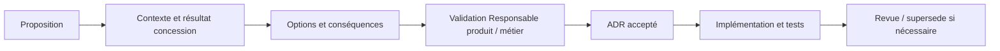

# Processus de décision d’architecture

## Objet
Rendre les décisions techniques et de périmètre produit cohérentes, visibles et réversibles lorsque cela est possible.

## Périmètre
Ce processus s’applique aux modules, échanges, responsabilités de données, changements de schéma, conceptions sensibles à la sécurité, comportement IA, topologie de déploiement et changements de périmètre. Les décisions OR, Garantie, Campagne technique, Réclamation Garantie, Capacité et Contrôle qualité sont également concernées.

## Principes
Décider au niveau responsable le plus bas, documenter les preuves, préférer l’option simple, consulter les parties prenantes et réexaminer les hypothèses obsolètes.

## Définitions
`ADR` signifie Architecture Decision Record. Le responsable de décision est responsable de la décision et pas nécessairement de son implémentation. `Superseded` indique qu’un ADR ultérieur remplace la décision tout en conservant l’historique.

## Règles
1. Décrire le contexte métier concession et les contraintes avant les options.
2. Comparer les alternatives viables et leurs conséquences.
3. Documenter risques, conséquences et options rejetées.
4. Obtenir la validation du Responsable produit pour un changement de périmètre, processus, indicateur ou rôle.
5. Relier l’implémentation et les tests à l’ADR.
6. Faire relire le vocabulaire par la Réception atelier, un Chef d’atelier, un Technicien et le Contrôle qualité avant publication UI.

## Exemples
« No billing » est un ADR car une facture modifierait l’identité, la responsabilité et les contrôles du produit. Rendre obligatoire un justificatif de Campagne technique avant le Contrôle qualité peut aussi exiger un ADR. Une simple correction de libellé n’en exige pas.

## Évolution future
Le Repository pourra ajouter un index ADR, des responsables, des dates de revue et un comité d’architecture léger selon la croissance de l’équipe.
