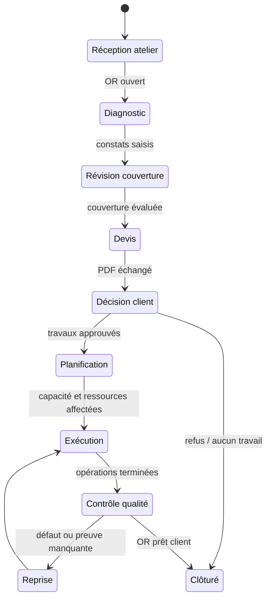

# Processus après-vente

## Objet
Décrire les processus de référence et leurs points de contrôle dans une concession automobile.

## Périmètre
Le parcours de référence est : Réception atelier → Ordre de Réparation (OR) → diagnostic → analyse Garantie/Campagne technique → PDF de devis → décision client → planification Chef d’atelier → opérations Technicien → Contrôle qualité → clôture opérationnelle.

## Principes
Chaque étape possède un responsable, des critères d’entrée et de sortie, des exceptions visibles et un passage de relais auditable. Le travail parallèle n’est permis que si ses dépendances sont explicites.

## Définitions
Un **critère d’entrée** est la condition de démarrage. Un **critère de sortie** est la condition de fin. Une **exception** est une dérogation autorisée avec motif et suivi. L’**engagement de restitution** est la promesse client pilotée par la capacité.

## Règles
1. La Réception crée ou rattache un OR unique à la visite et saisit le motif client.
2. Le diagnostic sépare les faits observés, les hypothèses et les recommandations.
3. Le PDF de devis est versionné avec direction, heure, statut et contexte OR.
4. La décision client est explicite : approuvée, refusée, en attente ou à clarifier.
5. La génération d’un PDF de devis ne vaut pas autorisation d’exécuter les travaux.
6. Le Chef d’atelier planifie selon la Capacité atelier et les Ressources atelier.
7. Les opérations Garantie et Campagne technique disposent de leurs justificatifs avant revue de la Réclamation Garantie.
8. Le Contrôle qualité vérifie les travaux, la sécurité et les justificatifs avant clôture.

## Exemples
Un diagnostic incomplet retourne à l’étape Diagnostic. Un PDF de devis refusé clôt le chemin des travaux proposés tout en conservant l’OR et le motif. Un échec du Contrôle qualité renvoie l’opération concernée au Technicien avec un défaut enregistré.

## Évolution future
Les sites pourront configurer des points de contrôle, délais d’escalade et processus spécialisés, sans modifier la sémantique d’état et d’audit documentée.
