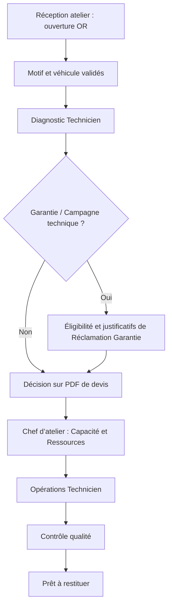

# Modèle opérationnel de l’après-vente

## Objet
Décrire comment une concession transforme une demande client en travaux coordonnés et contrôlés au moyen d’un Ordre de Réparation (OR).

## Périmètre
Le modèle couvre la Réception atelier, le cycle de l’OR, les responsabilités du Chef d’atelier, les opérations du Technicien, la Garantie, les Campagnes techniques, les Réclamations Garantie, la Capacité atelier, les Ressources atelier, la communication et le Contrôle qualité. La comptabilité et le stock physique sont hors périmètre.

## Principes
L’OR est le fil conducteur. Chaque passage de relais a un responsable, les écarts sont visibles et la dernière décision approuvée est retrouvable. NIMR-SAV-PRO accompagne l’organisation de la concession sans imposer un fonctionnement unique.

## Définitions
- **Ordre de Réparation (OR) :** enregistrement complet de la visite, du motif client et des opérations.
- **Réception atelier :** collecte du motif client, de l’identité du véhicule, de l’engagement de restitution et des besoins de mobilité.
- **Opération Technicien :** unité de travail attribuée à un Technicien, avec statut, résultat et justificatifs.
- **Garantie :** contexte de couverture nécessitant une vérification d’éligibilité et de justificatifs.
- **Campagne technique :** opération constructeur de contrôle, mise à jour ou réparation.
- **Réclamation Garantie :** paquet de justificatifs rattaché à l’OR pour revue de couverture ; il ne constitue pas une facture.
- **Capacité atelier :** disponibilité productive par compétence, baie, équipe et jour.
- **Ressources atelier :** techniciens, baies, outils, équipements de diagnostic et contraintes opérationnelles.
- **Contrôle qualité :** vérification technique, sécurité, justificatifs et disponibilité du véhicule pour le client.

## Règles
1. Un OR possède un responsable opérationnel courant et peut avoir plusieurs contributeurs.
2. Chaque transition conserve l’acteur, l’heure, le motif et les preuves utiles.
3. Une recommandation non approuvée reste une recommandation.
4. Une opération Garantie ou Campagne technique doit satisfaire ses exigences de justificatifs avant la revue de la Réclamation Garantie.
5. La Capacité atelier et les Ressources atelier sont planifiées explicitement par le Chef d’atelier.
6. La clôture opérationnelle est distincte de tout règlement financier.

## Exemples
La Réception atelier ouvre l’OR ; le Technicien consigne les contrôles et constats ; le conseiller prépare le PDF de devis ; le Chef d’atelier planifie les opérations selon la capacité ; le Contrôle qualité valide la restitution. Si une couverture s’applique, la Réclamation Garantie est constituée à partir des faits approuvés de l’OR.

## Évolution future
Chaque concession pourra ajouter des rôles, files, checklists et règles d’escalade configurables, sans modifier la responsabilité de l’OR ni les règles d’audit.
