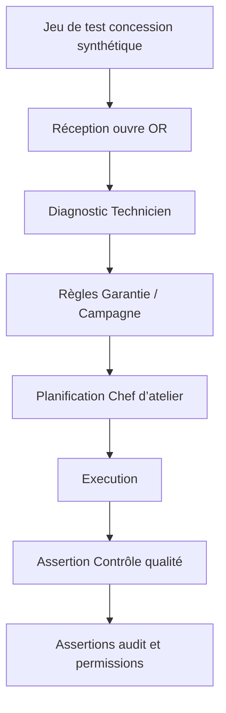

# Guide de test

## Objet
Démontrer que la plateforme produit un comportement sûr, correct et utile pour l’après-vente en concession.

## Périmètre
Les tests couvrent OR, Réception atelier, opérations Technicien, planification de la Capacité atelier par le Chef d’atelier, Garantie, Campagnes techniques, Réclamations Garantie, Contrôle qualité, permissions, PDF de devis, IA, UI, persistence, performance et recovery. Les tests finance/ERP sont hors périmètre, sauf pour vérifier l’absence de ces fonctions.

## Principes
Tester les comportements et contracts, garder les tests rapides et déterministes, isoler les dépendances externes, couvrir les entrées adverses et rendre les échecs diagnostiquables.

## Définitions
Les notions de test unitaire, test de contrat, test d’intégration, test de bout en bout, oracle de test et jeu de données de test sont employées en français. Un jeu de données de test représente des données synthétiques de concession.

## Règles
- Couvrir chaque règle métier par des cas positifs, négatifs et d’autorisation.
- Tester transitions OR légales et illégales, doublons, données obsolètes et retries.
- Vérifier checksum, métadonnées de révision et rejet des PDF non sûrs.
- Tester timeout IA, faible confiance, rejet, entrée ambiguë et dérogation humaine.
- Inclure accessibilité et appareils utilisés en atelier.
- Utiliser exclusivement des fixtures synthétiques et minimales.
- Une mise en production fournit les résultats applicables de compilation, tests unitaires, intégration, bout en bout, sécurité et migration.
- Les jeux de test représentent motif client, véhicule, compétences Technicien, Ressources atelier, éligibilité Garantie, contrôles Campagne technique, justificatifs de Réclamation Garantie et refus du Contrôle qualité.

## Exemples
Un test end-to-end fait ouvrir un OR par la Réception atelier, saisir un diagnostic par un Technicien, affecter capacité et ressources par le Chef d’atelier, échanger un PDF de devis, refuser un justificatif de Campagne technique manquant au Contrôle qualité et clôturer l’OR par un utilisateur autorisé.

## Évolution future
La suite pourra ajouter property-based state testing, mutation testing, load models mesurés et synthetic monitoring sans données client réelles.
