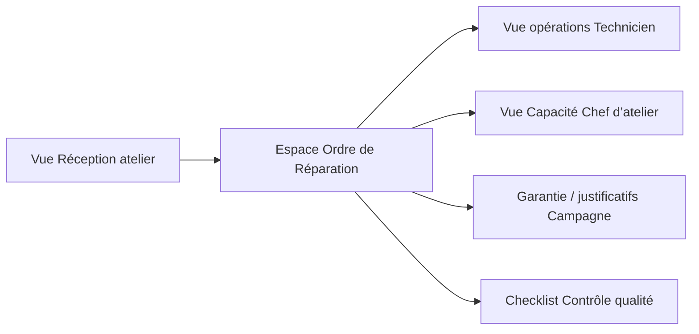

# Guide UI

## Objet
Créer une interface claire et homogène qui aide les professionnels de la concession à prendre rapidement la bonne décision.

## Périmètre
Les règles couvrent navigation, vues OR, formulaires de Réception atelier, listes de travail Technicien, pilotage Chef d’atelier, Garantie, Campagne technique, justificatifs de Réclamation Garantie, Contrôle qualité, PDF de devis, IA, accessibilité et erreurs.

## Principes
Afficher la prochaine action utile, conserver le contexte, rendre propriétaire et statut évidents, utiliser la divulgation progressive et ne jamais masquer l’incertitude derrière le design.

## Définitions
L’**action principale** fait avancer la responsabilité de l’utilisateur. Le **point de contrôle** est une exigence visible avant progression. Une **suggestion** est une sortie IA non autoritaire. L’en-tête OR affiche numéro OR, véhicule, client, engagement de restitution, responsable et statut.

## Règles
- La vue OR affiche identité, véhicule, motif, statut, responsable, engagement de restitution, blocages, événements récents et prochaine action.
- Les couleurs de statut sont accompagnées de texte et d’icônes.
- La Réception ouvre un OR avec recherche véhicule, motif client, promesse et besoins de mobilité.
- Le Technicien voit ses opérations, constatations, tests, justificatifs, exigences de compétence et blocages.
- Le Chef d’atelier voit les files, la Capacité atelier, les Ressources atelier et les exceptions.
- Le Contrôle qualité distingue travaux terminés, sécurité, justificatifs Garantie/Réclamation, exigences de Campagne technique et disponibilité client.
- Les suggestions IA montrent provenance, incertitude et actions accepter/modifier/refuser.
- Les PDF montrent révision, direction, horodatage et état de décision.
- Respecter les attentes d’accessibilité concernant focus, contraste, labels, erreurs et mouvement.

## Exemples
« OR prêt pour devis — preuve du test de freinage manquante » vaut mieux qu’un bouton désactivé sans explication. Un résumé IA apparaît à côté des faits sources et ne les remplace pas.

## Évolution future
La recherche auprès des concessions pourra faire évoluer libellés, responsive layouts, design tokens et localisation, avec validation par les rôles concernés.
